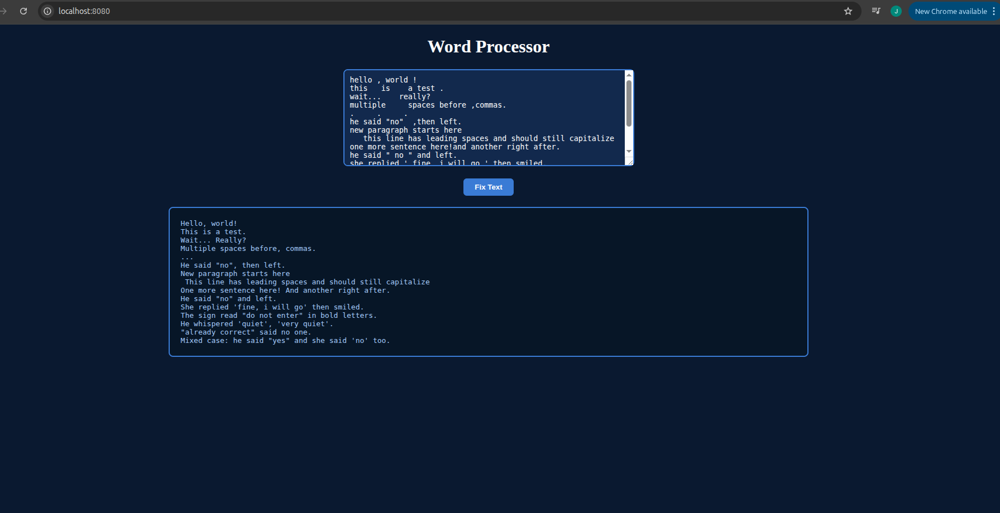

# word-processor-go-web

A web front-end for [word-processor-go](https://github.com/sundayjohnxavier47-png/word-processor-go.git) — paste text into a browser, get the cleaned-up version back instantly.

## Features

Same text-cleaning logic as the CLI version:
- Fixes punctuation spacing
- Fixes quote spacing
- Collapses multiple spaces
- Capitalizes the first letter of each sentence

## Usage

```bash
go run .
```

Then open `http://localhost:8080` in your browser, paste text into the box, and click "Fix Text."

## Project structure

- `main.go` — starts the HTTP server and handles form submissions
- `puncta.go`, `caps.go`, `quotes.go` — same text-processing logic as the CLI version
- `templates/index.html` — the web page

## Screenshot

